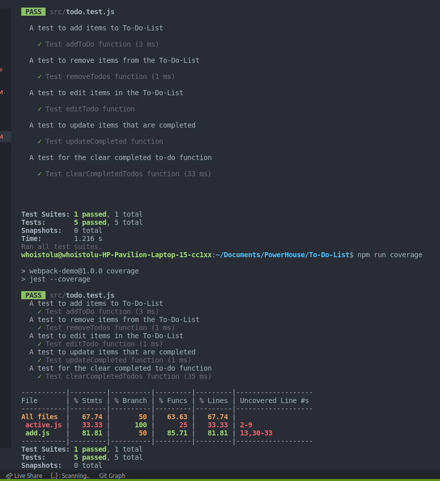

# To Doo List

## Built With

- HTML
- CSS
- JAVASCRIPT ES6
- Webpack
- Jest
- Babel
- Coverage

## To get a local copy run the following steps:
- Copy [this link](https://github.com/Whoistolu/To-Do-List)
- Open your terminal or command line
- Run "git clone Paste [this link](https://github.com/Whoistolu/To-Do-List)"
- Open the folder with your code editor
- Create a branch to work on
- Now You can edit the code and do a pull request

## Authors

👤 **Author1**

- Name: Ajise Toluwase
- GitHub: [@githubhandle](https://github.com/Whoistolu)
- Twitter: [@twitterhandle](https://twitter.com/Littletolu)
- LinkedIn: [LinkedIn](https://www.linkedin.com/in/toluwase-ajise-9b40411b2/)

👤 **Author2**

- Name: Kasongo Mukebo Ben
- GitHub: [@githubhandle](https://github.com/BenMukebo)
- Twitter: [@twitterhandle](https://twitter.com/BenMukebo)
- LinkedIn: [LinkedIn](https://www.linkedin.com/in/kasongo-mukebo-ben-591720205/)

## 🤝 Contributing

Contributions, issues, and feature requests are welcome!

## Show your support

Give a ⭐️ if you like this project!

## Acknowledgments

- Inspiration
  Original design idea by [Cindy Shin in Behance](https://www.behance.net/adagio07)

## 📝 License

This project is [MIT](./MIT.md) licensed.
