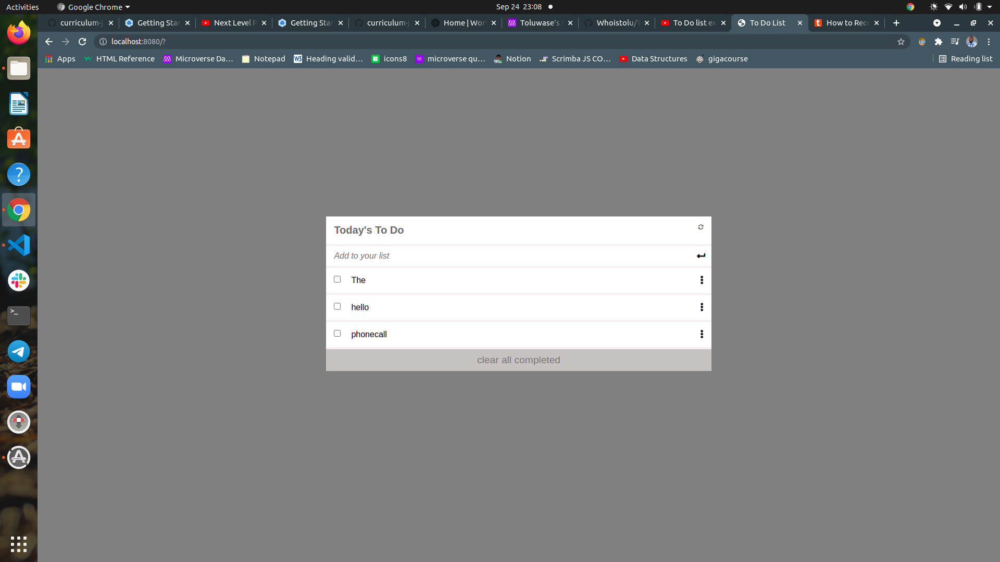

# To Doo List

[Live Demo](https://whoistolu.github.io/To-Do-List/dist/)

This is my capstone project for the HTML/CSS module.
An open source web development conference site.

This capstone consists of the mobile and desktop versions with the following sectins:
1. The navbar.
2. The homepage.
3. The featured speakers section.
4. User interactions: link, mobile menu.
## Built With

- HTML
- CSS
- JAVASCRIPT ES6
- Webpack

## To get a local copy run the following steps:
- Copy [this link](https://github.com/Whoistolu/To-Do-List)
- Open your terminal or command line
- Run "git clone Paste [this link](https://github.com/Whoistolu/To-Do-List)"
- Open the folder with your code editor
- Create a branch to work on
- Now You can edit the code and do a pull request

## Authors

👤 **Author1**

- Name: Ajise Toluwase
- GitHub: [@githubhandle](https://github.com/Whoistolu)
- Twitter: [@twitterhandle](https://twitter.com/Littletolu)
- LinkedIn: [LinkedIn](https://www.linkedin.com/in/toluwase-ajise-9b40411b2/)

## 🤝 Contributing

Contributions, issues, and feature requests are welcome!

## Show your support

Give a ⭐️ if you like this project!

## Acknowledgments

- Inspiration
  Original design idea by [Cindy Shin in Behance](https://www.behance.net/adagio07)

## 📝 License

This project is [MIT](./MIT.md) licensed.
